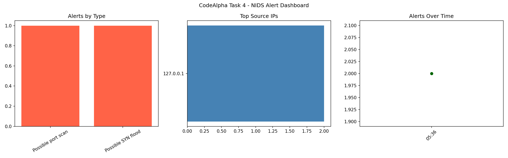

# CodeAlpha_NetworkIntrusionDetectionSystem

**CodeAlpha Cyber Security Internship — Task 4: Network Intrusion Detection System**

A lightweight, rule-based Network Intrusion Detection System (NIDS) built in
Python with [Scapy](https://scapy.net/). It sniffs live network traffic (or
reads a `.pcap` file), applies configurable detection rules, raises alerts in
real time, and visualizes them on a simple dashboard.

> ⚠️ **Legal & Ethical Notice**: Only run this tool on networks and devices
> you own or have explicit written permission to monitor/test. Unauthorized
> packet capture may violate local laws and your organization's policies.

## Features

- **Rule-based detection engine** covering:
  - Port scan detection (many distinct destination ports from one source in a short window)
  - SYN flood detection (high rate of TCP SYN packets without ACK)
  - ICMP flood / ping sweep detection
  - Blacklisted IP matching
  - Suspicious payload signature matching (e.g. SQLi/XSS-style strings)
- **Configurable thresholds** via `rules.json` — no code changes needed to tune sensitivity.
- **Structured alert logging** to `alerts.log` in JSON-lines format (easy to parse, grep, or feed into a SIEM).
- **Visualization dashboard** (`dashboard.py`) that plots alerts by type, top offending source IPs, and an alert timeline, saved as `dashboard_output.png`.
- Works on **live interfaces** or on a **previously captured `.pcap` file**, so it can be demoed without a live attack.

## Project Structure

```
CodeAlpha_NetworkIntrusionDetectionSystem/
├── nids.py            # Main detection engine (sniffing + rules + alerting)
├── rules.json         # Editable detection thresholds & blacklist/signatures
├── dashboard.py        # Reads alerts.log and generates visual charts
├── requirements.txt    # Python dependencies
└── README.md
```

## Setup

```bash
git clone https://github.com/farido21/CodeAlpha_NetworkIntrusionDetectionSystem.git
cd CodeAlpha_NetworkIntrusionDetectionSystem
pip install -r requirements.txt
```

Scapy needs raw socket / packet capture privileges:
- **Linux/macOS:** run with `sudo`
- **Windows:** install [Npcap](https://npcap.com/) first, and run your terminal as Administrator

## Usage

### 1. Live traffic monitoring

```bash
sudo python3 nids.py --iface eth0
```

Leave off `--iface` to let Scapy pick the default interface. Alerts print to
the console and are appended to `alerts.log`.

### 2. Analyze an existing capture (no live traffic needed)

```bash
python3 nids.py --pcap sample_traffic.pcap
```

This is the easiest way to demo the tool for a video walkthrough — capture
some sample traffic once (e.g. with Wireshark) and replay it through the
engine.

### 3. Visualize results

```bash
python3 dashboard.py --log alerts.log
```

Generates `dashboard_output.png` with three panels: alerts by type, top
source IPs, and an alert timeline.

## Configuring Detection Rules

Edit `rules.json` to tune detection sensitivity:

```json
{
  "port_scan": { "enabled": true, "distinct_ports_threshold": 15, "time_window_seconds": 10 },
  "syn_flood": { "enabled": true, "syn_count_threshold": 100, "time_window_seconds": 5 },
  "icmp_flood": { "enabled": true, "icmp_count_threshold": 50, "time_window_seconds": 5 },
  "blacklisted_ips": ["1.2.3.4"],
  "suspicious_payload_signatures": ["union select", "drop table", "<script>"]
}
```

## How Detection Works (Response Mechanism)

Each rule keeps a sliding time-window per source IP. When a threshold is
crossed, an alert is raised **once** and then enters a short cooldown period
(10s) to avoid flooding the log with duplicate alerts for an ongoing attack.
This satisfies the "response mechanism for detected intrusions" requirement
at a proof-of-concept level — in production this hook is where you'd add
actions like firewall auto-blocking, email/Slack notifications, or SIEM
integration.

## Task Mapping (CodeAlpha Task 4 requirements)

| Requirement | Implementation |
|---|---|
| Set up a network-based IDS | `nids.py` (Scapy-based sniffer + rule engine), as a lightweight alternative to Snort/Suricata |
| Configure rules and alerts | `rules.json` + `RuleEngine` class |
| Monitor traffic continuously | `sniff()` live loop, or `--pcap` for offline analysis |
| Response mechanism for detected intrusions | Alert logging + cooldown throttling; extensible hook for auto-block/notify |
| (Optional) Visualize attacks | `dashboard.py` — bar/line charts of alerts |

 ## Sample Output Below is a real detection run against a simulated port scan (nmap -p 1-1000 127.0.0.1). The NIDS correctly flagged both a port scan and a SYN flood pattern from the same source: 
 
## Disclaimer

This project is for educational purposes as part of the CodeAlpha Cyber
Security internship. Use responsibly and only on infrastructure you are
authorized to test.
